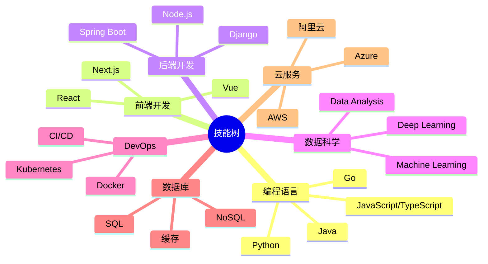

# 📊 数据驱动的开发者

<div align="center">

```ascii
╔══════════════════════════════════════════════════════════════╗
║                    你的名字 | 全栈开发工程师                      ║
║                    📍 中国 | 📧 your.email@example.com        ║
╚══════════════════════════════════════════════════════════════╝
```


</div>

---

## 📈 年度统计总览

<div align="center">

| 指标 | 数值 | 年度增长 |
|:---:|:---:|:---:|
| 🏆 总提交数 | 2,500+ | ↑ 35% |
| 📦 开源项目 | 50+ | ↑ 28% |
| ⭐ 获得星标 | 1,000+ | ↑ 45% |
| 🤝 贡献项目 | 30+ | ↑ 50% |
| 📝 代码行数 | 100K+ | ↑ 40% |

</div>

---

## 🎯 核心能力矩阵

### 编程语言熟练度

```text
Python       ████████████████████░░   90%
JavaScript   ████████████████████░░   85%
TypeScript   ███████████████████░░░   80%
SQL          ██████████████████░░░░   75%
Java         █████████████████░░░░░   70%
Go           ████████████████░░░░░░   65%
Rust         ██████████░░░░░░░░░░░   45%
```

### 技术栈分布

<details open>
<summary><b>🔹 前端开发</b></summary>

| 技术 | 熟练度 | 使用年限 | 主要项目数 |
|:---|:---:|:---:|:---:|
| React / Next.js | ⭐⭐⭐⭐⭐ | 4年 | 18+ |
| Vue.js | ⭐⭐⭐⭐ | 3年 | 12+ |
| TypeScript | ⭐⭐⭐⭐⭐ | 3年 | 20+ |
| Tailwind CSS | ⭐⭐⭐⭐ | 2年 | 15+ |

</details>

<details>
<summary><b>🔹 后端开发</b></summary>

| 技术 | 熟练度 | 使用年限 | 主要项目数 |
|:---|:---:|:---:|:---:|
| Node.js / Express | ⭐⭐⭐⭐⭐ | 5年 | 22+ |
| Python / Django | ⭐⭐⭐⭐⭐ | 4年 | 18+ |
| Spring Boot | ⭐⭐⭐⭐ | 3年 | 12+ |
| FastAPI | ⭐⭐⭐⭐ | 2年 | 10+ |

</details>

<details>
<summary><b>🔹 数据库 & 大数据</b></summary>

| 技术 | 熟练度 | 使用年限 | 主要项目数 |
|:---|:---:|:---:|:---:|
| PostgreSQL | ⭐⭐⭐⭐⭐ | 5年 | 25+ |
| MongoDB | ⭐⭐⭐⭐⭐ | 4年 | 20+ |
| Redis | ⭐⭐⭐⭐ | 3年 | 15+ |
| MySQL | ⭐⭐⭐⭐ | 4年 | 18+ |

</details>

<details>
<summary><b>🔹 DevOps & 云平台</b></summary>

| 技术 | 熟练度 | 使用年限 | 主要项目数 |
|:---|:---:|:---:|:---:|
| Docker | ⭐⭐⭐⭐⭐ | 4年 | 30+ |
| Kubernetes | ⭐⭐⭐⭐ | 2年 | 12+ |
| AWS | ⭐⭐⭐⭐⭐ | 4年 | 20+ |
| CI/CD (GitHub Actions) | ⭐⭐⭐⭐⭐ | 3年 | 25+ |

</details>

---

## 📊 GitHub 深度分析

<div align="center">

### 整体统计


### 连续提交记录


### 详细语言统计


</div>

---

## 🏅 成就系统

<div align="center">

### GitHub 奖杯收集


### 技能认证徽章


</div>

---

## 📅 贡献热力图

<div align="center">


</div>

---

## 🔥 代码活动统计

<div align="center">

```text
📊 本周编码时间统计

TypeScript    12 hrs 30 mins  ████████████░░░░░░░░  45.2%
JavaScript     8 hrs 15 mins  ████████░░░░░░░░░░░░  29.8%
Python         4 hrs 20 mins  ████░░░░░░░░░░░░░░░░  15.7%
SQL            1 hr 45 mins   █░░░░░░░░░░░░░░░░░░░   6.3%
Other          50 mins        ░░░░░░░░░░░░░░░░░░░░   3.0%
```

</div>

---

## 📚 最近项目性能指标

<div align="center">

| 项目 | 语言 | Stars | Forks | Issues | PRs | 活跃度 |
|:---:|:---:|:---:|:---:|:---:|:---:|:---:|
| 项目1 | TypeScript | 500+ | 80+ | 10 | 45 | 🔥🔥🔥🔥🔥 |
| 项目2 | Python | 300+ | 50+ | 5 | 30 | 🔥🔥🔥🔥 |
| 项目3 | JavaScript | 200+ | 30+ | 8 | 25 | 🔥🔥🔥 |
| 项目4 | Go | 150+ | 20+ | 3 | 15 | 🔥🔥 |

</div>

---

## 🎓 技能树



---

## 💼 工作经历时间线

```text
2025 - 现在  │  高级全栈工程师 @ [公司名称]
             │  ├─ 领导团队开发大型 Web 应用
             │  ├─ 实现微服务架构
             │  └─ 提升系统性能 40%
             │
2022 - 2025  │  全栈开发工程师 @ [公司名称]
             │  ├─ 开发多个核心产品功能
             │  ├─ 优化数据库查询性能
             │  └─ 指导初级开发人员
             │
2020 - 2022  │  前端开发工程师 @ [公司名称]
             │  ├─ 构建响应式 Web 应用
             │  ├─ 实现组件库
             │  └─ 改进用户体验
```

---

## 🎯 2025 年度目标追踪

<div align="center">

| 目标 | 进度 | 完成度 |
|:---|:---:|:---:|
| 贡献 10+ 开源项目 | ████████░░ | 80% |
| 学习 Rust 语言 | ██████░░░░ | 60% |
| 发布技术文章 50+ | ███████░░░ | 70% |
| 获得 2000+ GitHub Stars | ████░░░░░░ | 40% |
| 完成 AWS 认证 | ██████████ | 100% ✅ |
| 开发个人 SaaS 产品 | ███░░░░░░░ | 30% |

</div>

---

## 📫 联系方式 & 社交媒体

<div align="center">

[](https://linkedin.com/in/你的用户名)
[](https://twitter.com/你的用户名)
[](mailto:your.email@example.com)
[](https://github.com/你的GitHub用户名)
[](https://yourblog.com)

</div>

---

<div align="center">

### 📊 实时数据更新


---

**💡 "数据不会说谎，代码不会背叛"**

*最后更新: 自动生成 | 数据来源: GitHub API*


</div>

